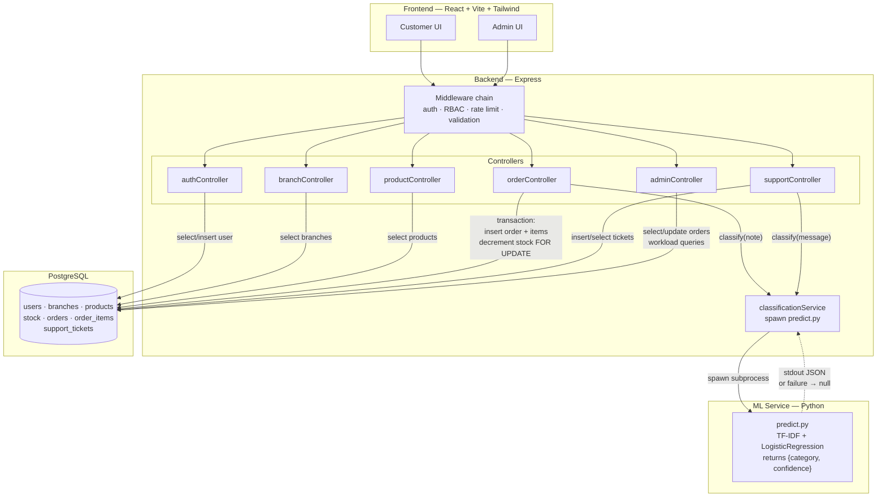

# Smart Order Allocation System

A full-stack order management system for a multi-branch business that
**automatically allocates each incoming order to the most suitable branch**,
based on stock availability, distance from the customer, and current branch
workload. 

---

## Technologies used

| Layer | Technology |
|---|---|
| Backend | Node.js, Express |
| Database | PostgreSQL (raw SQL via `pg`, no ORM) |
| Frontend | React (Vite), Tailwind CSS, React Router |
| Maps / location | Leaflet.js + OpenStreetMap (no API key), browser Geolocation API |
| Auth | JWT (`jsonwebtoken`), `bcrypt` password hashing |
| AI/ML | Python, scikit-learn (TF-IDF + Logistic Regression) |
| Security middleware | `helmet`, `express-rate-limit`, `express-validator`, `cors` |
| Testing | Jest |

---

# Folder Structure

```

smart-order-allocation/
├── backend/
│   ├── db/
│   │   ├── migrations/            SQL migration files (schema, indexes)
│   │   ├── migrate.js             migration runner  (npm run migrate)
│   │   └── seed.js                seeds branches, products, stock, users (npm run seed)
│   ├── ml/
│   │   ├── train_classifier.py    trains TF-IDF + Logistic Regression pipeline
│   │   ├── predict.py             CLI used by the Node backend (one JSON line to stdout)
│   │   ├── model.pkl              produced by train_classifier.py
│   │   ├── requirements.txt
│   │   └── Customer_Message_Dataset.csv
│   ├── src/
│   │   ├── config/                allocation weights, DB pool, env loader
│   │   │   ├── allocation.js
│   │   │   ├── db.js
│   │   │   └── env.js
│   │   ├── controllers/           thin HTTP handlers
│   │   │   ├── adminController.js
│   │   │   ├── authController.js
│   │   │   ├── branchController.js
│   │   │   ├── orderController.js
│   │   │   ├── productController.js
│   │   │   └── supportController.js
│   │   ├── middleware/            auth, RBAC, rate limit, validation, error handler
│   │   ├── models/                only layer that talks to Postgres
│   │   │   ├── branchModel.js
│   │   │   ├── orderModel.js
│   │   │   ├── productModel.js
│   │   │   ├── stockModel.js
│   │   │   ├── supportTicketModel.js
│   │   │   └── userModel.js
│   │   ├── routes/                route definitions + middleware wiring
│   │   │   ├── adminRoutes.js
│   │   │   ├── authRoutes.js
│   │   │   ├── branchRoutes.js
│   │   │   ├── index.js
│   │   │   ├── orderRoutes.js
│   │   │   ├── productRoutes.js
│   │   │   └── supportRoutes.js
│   │   ├── services/              business logic (framework-agnostic, unit-testable)
│   │   │   ├── allocationService.js
│   │   │   ├── authService.js
│   │   │   ├── classificationService.js
│   │   │   └── distanceService.js
│   │   ├── utils/
│   │   │   └── logger.js
│   │   └── app.js                 Express app: middleware + route mounting
│   ├── tests/                     Jest unit tests (allocation algorithm)
│   ├── .env / .env.example
│   ├── package.json
│   └── server.js                  process entry: loads env, starts HTTP server
│
├── frontend/
│   ├── public/
│   ├── src/
│   │   ├── api/                   axios wrappers per resource
│   │   │   ├── authApi.js
│   │   │   ├── axiosClient.js     base URL + JWT attach + 401 handling
│   │   │   ├── branchApi.js
│   │   │   └── orderApi.js
│   │   ├── components/
│   │   │   ├── common/            Button, Card, Input, NavBar, Pagination,
│   │   │   │                      SearchBar, ConfirmDialog, ReportIssueDialog,
│   │   │   │                      Sidebar, LoadingSpinner, ErrorBanner, ScrollToTop
│   │   │   ├── LocationPicker/    Leaflet map picker (geolocation pre-fill)
│   │   │   ├── OrderForm/         OrderForm, ProductCard, CartSummary
│   │   │   ├── OrderStatusBadge/
│   │   │   └── register/          PasswordRules, ProtectedRoute
│   │   ├── context/               AuthContext (JWT storage, user state)
│   │   ├── hooks/                 useAuth
│   │   ├── pages/                 one file per route
│   │   │   ├── AdminBranches.jsx
│   │   │   ├── AdminDashboard.jsx
│   │   │   ├── AdminLayout.jsx
│   │   │   ├── AdminProducts.jsx
│   │   │   ├── AdminSupportTickets.jsx
│   │   │   ├── CustomerOrderPage.jsx
│   │   │   ├── Login.jsx
│   │   │   ├── NotFound.jsx
│   │   │   ├── OrderListPage.jsx
│   │   │   └── Register.jsx
│   │   ├── styles/index.css
│   │   ├── utils/password.js      password policy rules (pure functions)
│   │   ├── App.jsx                routes + protected route wrapping
│   │   └── main.jsx               React root, BrowserRouter, AuthProvider
│   ├── .env / .env.example
│   ├── index.html
│   ├── tailwind.config.js
│   ├── postcss.config.js
│   ├── vite.config.js
│   └── package.json
│
├── Customer_Message_Dataset.csv   sample dataset for the ML classifier
└── README.md

```

## Setup instructions

### 1. Database
```bash
createdb smart_order_allocation
```

### 2. Backend
```bash
cd backend
cp .env.example .env        # fill in DATABASE_URL, JWT_SECRET, etc.
npm install
npm run migrate             # applies db/migrations/*.sql
npm run seed                # seeds branches, products, stock, admin + demo user
npm run dev                 # starts on http://localhost:5000
```

Seeded accounts:
- Admin: `admin@dartcodes.test` / `Admin@12345`
- Customer: `customer@dartcodes.test` / `Customer@12345`

### 3. AI/ML classifier (optional but required for note classification to work)
```bash
cd backend/ml
pip install -r requirements.txt
python train_classifier.py Customer_Message_Dataset.csv
```
This produces `model.pkl`, which `predict.py` loads at inference time. If
`model.pkl` doesn't exist yet, order creation still works — the note is
simply left unclassified (see "AI/ML approach" below for the exact failure
handling).

### 4. Frontend
```bash
cd frontend
cp .env.example .env        # VITE_API_BASE_URL=http://localhost:5000/api
npm install
npm run dev                 # starts on http://localhost:5173
```

### 5. Tests
```bash
cd backend
npm test
```

---

## System architecture



- **Routes** declare validation rules and which middleware guards them.
- **Controllers** stay thin: parse the request, call a service, shape the response.
- **Services** hold all business logic (`allocationService`, `distanceService`,
  `authService`, `classificationService`) — deliberately decoupled from
  Express, so the allocation algorithm is unit-testable without a running
  server (`tests/allocationService.test.js`).
- **Models** are the only layer that talks to PostgreSQL (parameterized
  queries, no ORM — kept the schema and query plans fully visible/tunable).

---

## Branch allocation logic

### The problem
For each order (one or more products + quantities + a delivery location),
pick the branch that's the overall best fit, considering three factors that
can conflict: **stock availability, distance, and current workload**.

### Two-phase design

**Phase 1 — Eligibility filtering.** A branch is only a candidate if it can
cover *every* line item in the order. This is implemented as a **set
intersection**: for each ordered product, find the set of branches carrying
enough stock (`stock` table, filtered `quantity >= requested`), then
intersect those sets across all items in the order. A branch surviving the
intersection can fulfil the whole order. A soft distance sanity cutoff
(100km) is also applied here — generous enough to rarely matter, but it
protects against an absurd cross-country allocation.

**Phase 2 — Weighted ranking.** Among eligible branches, compute:

```
score = 0.40 × workloadScore + 0.35 × proximityScore + 0.25 × stockSurplusScore
```

- `proximityScore = 1 / (1 + distanceKm)` — Haversine distance, smoothly
  decaying, no arbitrary cutoff needed.
- `workloadScore = 1 / (1 + activeOrderCount)` — fewer active orders at a
  branch = closer to 1.
- `stockSurplusScore` — how much spare stock the branch has beyond what's
  needed, capped and normalized to 0–1 (diminishing returns past a small
  surplus — it's a robustness signal, not the main driver).

The highest-scoring branch is chosen. Ties are broken deterministically
(higher workload score first, then lowest branch ID) so behaviour is never
ambiguous.

### Why these weights, and why hardcoded
Weights are **hardcoded** in `backend/src/config/allocation.js` — one file,
not scattered magic numbers — and were chosen from reasoned business
priority, not tuned against historical data (none exists yet for a new
system):

- **Workload weighted highest (0.40)** — an overloaded branch delays every
  order it touches; this is the failure mode most likely to hurt customer
  experience.
- **Proximity next (0.35)** — affects delivery time, but a slightly farther
  branch is a *slower* order, not a *broken* one.
- **Stock surplus weighted lowest (0.25)** — eligibility already guarantees
  "enough" stock; surplus is mainly a tiebreak/robustness signal.

We considered learning these weights with ML (e.g. logistic regression over
labeled preference scenarios) but rejected it for v1: there's no historical
fulfillment-outcome data to learn from, and any "ML-learned" weight without
that data would really just be a regression over our own synthetic opinions
— not more rigorous than stating the reasoning directly. See "Future
improvements" below.

### Data structures & algorithms
- **HashMap** (`productId → Map<branchId, quantity>`) built from the
  fetched stock rows — this is the in-memory "inverted index" that makes
  eligibility checking fast without scanning every branch.
- **Set intersection** across order line items for eligibility.
- **Array sort** for ranking (a max-heap would give O(log K) top-1 selection
  vs O(K log K) for a full sort, but at the expected scale — a handful to a
  few dozen branches — a sort is simpler, equally fast in practice, and
  easier to read; the complexity argument is what matters here, not the
  literal heap).
- **Complexity**: naive approach is O(branches × products) per order (check
  every branch against every product). This approach only fetches stock
  rows relevant to the order's specific products, making eligibility
  roughly O(orderItems × avgBranchesPerProduct), which is far smaller when
  most products aren't carried at every branch.

### DB-level counterpart
- Composite index `stock(product_id, branch_id, quantity)` — the persistent,
  disk-backed equivalent of the in-memory inverted index; lets Postgres
  answer "which branches carry this product, with enough quantity" via an
  index-only scan.
- Partial index `stock(product_id, branch_id) WHERE quantity > 0` — skips
  zero-stock rows entirely.
- Indexes on `orders.branch_id`, `orders.status`, `orders.customer_id`,
  `orders.created_at` — back the workload count query and the admin
  dashboard's search/filter.
- Haversine distance is computed in application code, not via PostGIS/a
  geospatial index — a deliberate scope decision. PostGIS is the *correct*
  tool at large branch counts, but adds real setup complexity for
  negligible gain at the scale this system is designed for (dozens of
  branches, not thousands).

### Concurrency
Stock is decremented and the order row is created inside a **single DB
transaction**, with `SELECT ... FOR UPDATE` row locking on the stock rows
being decremented. This prevents two near-simultaneous orders from both
succeeding against the same last unit of stock — the second one re-checks
actual stock at commit time (not just at allocation-scoring time) and fails
cleanly (409) if it's no longer available.

### Edge cases handled
- **No eligible branch** → the order is still recorded (status
  `unfulfillable`), not silently dropped — visible to admins.
- **Order cancellation** → stock is restored and workload recalculates
  automatically (workload is computed live from active order counts, not a
  separately-tracked counter that could drift).
- **Tied scores** → deterministic tiebreaker (see above).
- **Race condition on last unit of stock** → handled via the transaction +
  row lock described above; verified manually (see note below).
- **Multi-product order where no single branch covers everything** →
  currently rejected as a whole (the intersection is empty → treated as no
  eligible branch). Splitting an order across branches is a natural next
  step, noted below, but was out of scope to keep the core logic correct
  and well-tested within the time available.

---

## Authentication & security approach

- **Password hashing**: bcrypt, configurable salt rounds via env var.
- **Auth**: stateless JWT, issued on login/register, verified on every
  protected request. Token expiry is configurable (`JWT_EXPIRES_IN`,
  default 1h) — on expiry, the API returns 401 and the frontend clears
  local auth state and redirects to login.
- **RBAC**: two roles, `customer` and `admin`, embedded directly in the JWT
  payload. Enforced with two composable middlewares: `authenticate` (is the
  token valid?) and `requireRole(...)` (is this role allowed here?). Every
  `/api/admin/*` route requires both, applied at the router level so no
  individual route can accidentally skip the check.
- **Ownership checks beyond role**: a `customer` role alone isn't sufficient
  to view/cancel *any* order — the handler additionally verifies
  `order.customer_id === req.user.userId`. This was explicitly verified:
  see "What was tested" below.
- **Input validation**: `express-validator` on every route that accepts a
  body — email format, password strength (min 8 chars + a digit), integer
  IDs, positive quantities, lat/long ranges, note length cap.
- **Secrets**: all config (`DATABASE_URL`, `JWT_SECRET`, etc.) comes from
  environment variables via `.env` (see `.env.example`), never hardcoded.
- **Rate limiting**: a tight limiter (10 requests / 15 min) on
  `/auth/login` and `/auth/register` specifically, against brute-force /
  credential stuffing; a looser general limiter (120/min) on the rest of
  the API.
- **Other hardening**: `helmet` for standard security headers, CORS
  restricted to the known frontend origin (not `*`), `express.json({limit:
  '100kb'})` to cap request body size.
- **HTTPS**: not applicable to local development; required in any real
  deployment — noted as a deployment-time requirement rather than something
  meaningful to implement in a local dev server.
- **Frontend role-gating is UX only**: hiding the admin link/route in React
  for non-admins is purely cosmetic. The actual security boundary is
  entirely server-side — verified directly (see below), not assumed.

---

## AI/ML approach

**Task**: classify a customer's free-text message (order note or post-order support message) into a category, return a confidence score, and define clear behaviour for low-confidence predictions — without ever blocking order creation or hiding the model's best guess from the customer.

**Approach**: TF-IDF vectorization (unigrams + bigrams, English stop words removed) feeding a Logistic Regression classifier (`class_weight=balanced` to handle any class imbalance), wrapped in a scikit-learn `Pipeline`. Chosen over embeddings or a deep-learning approach because:

- The dataset is small (~450 rows, 8 classes) — a linear model on sparse TF-IDF features fits this scale well and is much less prone to overfitting than a heavier model would be.
- It's fully explainable — the coefficients directly show which words/phrases drive each prediction, which matters for defending the approach in the technical interview.
- Training and inference are both near-instant (no GPU needed), which fits a simple subprocess-per-request architecture rather than a standing model server.


**Result**: 84% accuracy on a held-out 20% stratified test split. Full per-class precision/recall is printed by `train_classifier.py`.

---

## Assumptions & limitations

- **Customer location**: captured via a Leaflet.js map picker pre-filled by
  the browser Geolocation API (no paid geocoding API used). Branch
  locations are static, pre-seeded lat/long.
- **Branch count assumed small** (dozens, not thousands) — this justified
  both the in-app-code Haversine calculation (vs. PostGIS) and a plain
  array sort (vs. a hand-rolled heap) for ranking.
- **Allocation weights are static and hand-reasoned**, not learned from
  historical outcome data (none exists for a brand-new system). See "Future
  improvements."
- **Orders spanning multiple products with no single branch covering all
  of them are rejected as a whole**, not split across branches.
- **Only two roles implemented** (`customer`, `admin`) — a
  branch-scoped `branch_manager` role was considered but not built, to keep
  the two core roles fully correct and tested within the time available.
- **HTTPS** is a deployment concern, not implemented in the local dev
  setup.
- **The 10 unlabeled rows** in the provided dataset were excluded from
  classifier training (they can't supervise a model without a label).

## Future improvements
- Learn allocation weights from real fulfillment outcome data (e.g. via
  regression, or an online/bandit approach that adjusts weights based on
  observed delivery time, cancellation rate, etc.) once such data exists.
- Branch-scoped `branch_manager` role, with per-branch query scoping.
- Partial/split fulfillment across branches for multi-product orders that
  no single branch can fully cover.
- Admin-configurable allocation weights (currently hardcoded, deliberately,
  for v1 — see rationale above).
